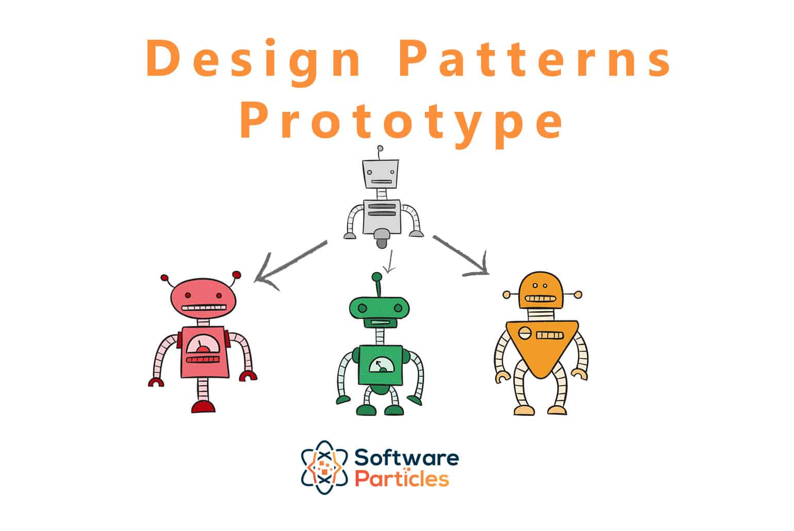
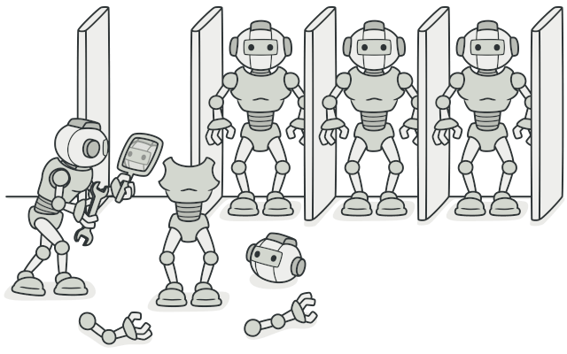

# Prototype 

The Prototype design pattern is a creational design pattern that allows you to create copies of objects without coupling your code to their specific classes. It involves creating a prototype object and then creating new objects by copying this prototype. This pattern is useful when creating objects is expensive or when you want to isolate the process of object creation from the client code.

### Implement a Prototype

We start by creating a class which will be a prototype
* The class must implement *Clonable* interface.
* class should override clone method and return copy of itself.
* The method should declare CloneNotSupportedException in throws clause to give subclasss change to decide on whether to support clonnig.

>[!NOTE]
> clone method implementation should consider the deep & shallow copy and choose whichever is

### Example of a Prototype

1. actually the Object.clone() method is an example of a prototype.
2. This method is provided by java and can clone an existing object, thus allowing any object to act as a prototype. Classes still need to be Cloneable but the method does the job of cloning object

>[!IMPORTANT]
> Use prototype when you have a bunch of classes with its state that is most immutable

### Prototype vs Singleton

| Aspect | Prototype | Singleton |
|--------|-----------|-----------|
| Purpose | Creates objects by duplicating an existing prototype. | Ensures that only one instance of a class exists throughout the system. |
| Use | Useful when the creation of an object is costly and we want to avoid it by duplicating an existing object. | Useful when strict control over global instances is needed because it only allows one instance of a class. |
| Flexibility | More flexible as it allows cloning existing objects at runtime. | Less flexible as it restricts the instantiation of a class to a single object. |

### Pitfalls
* Usabillity depends upon the number of properties in state that are immutable or can be shallow copied. An object where state is comprised of large number of mutable object is complicated to clone.
* In java default clone operation will only perfom the shallow copy so if you need a need copy you've to impletent int.
* Subclasses may not be able to support clone and so the code becomes complicated as you have to code for situations where an implementation may not support clone.

### Summary 
* Think of prototype pattern when you have an object where construction of a new instance is costly or not possible ( object is supplied to your code ).
* In java we typically implement this pattern with clone method.
* Objects which have a majority of their state as immutable are good candidates for prototypes.
* When implementing clone method pay attention to the requierement of deep or shallow copy of object state.
* Alse we've to insure that clone is "initialized"; that is appropriate states are reset before returning the copy to outside world.