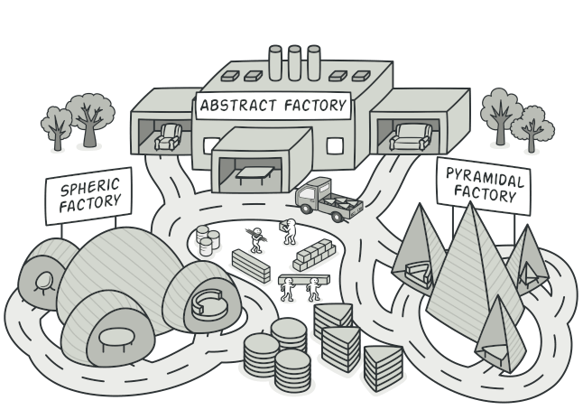

# :star: Abstract Factory :star:

*_Abstract_* Factory is a creational design pattern that lets you produce families of related objects without specifying their concrete classes.

[Refactoring Guru](https://refactoring.guru/design-patterns/abstract-factory)

* Abstract factory is used when we have two or more objects which work togetherforming a kit or set and there can be multiple sets or kits that can be created by client code.
* So we separate client code form concrete objects forming such a set and also from the code which creates these sets.

>[!IMPORTANT]
>Abstract Factory group classes with the same goal, like storage and instance (_see the example_)

### Implement Abstract Factory :hammer:

We start by studying the product "sets"
* Create abstract facotry as an abstrac class or an interface.
* Abstract factory defines abstract methods for creating products.
* Provide concrete implementation of factory for each set of products.
Abstract factory makes use of factory method pattern. You can think of abstract as an object with multiple factory methods...

### Implementation Considerations

* Factories can be implemented as singletons, we typically ever need only one instance of it anyway. But make sure to familiarize yourself with drawbacks of singletons.
* Adding a new type requieres changes to the base factory as well as all implementations of factory.
* We provide the client code with concrete factory so that it can create objects.

### Design considerations :leaf:

* When you want to constrain object creations so that they all work together then abstract factory is good design patterns.
* Abstract facoty uses factory method pattern.
* If objects are expensive to create then you can transparently switch factory implementations to use prototype design pattern to create objects.

### Abstract factory vs Factory method :factory:

| Aspect | Abstract Factory | Factory Method |
|--------|------------------|----------------|
| Purpose | Provides an interface for creating families of related or dependent objects without specifying their concrete classes. | Defines an interface for creating an object, but lets subclasses decide which class to instantiate. |
| Flexibility | More complex and flexible. Can produce families of related objects. | Less complex. Each factory method creates a single type of object. |
| Structure | A system of multiple factories. | A single factory class. |
| Use Case | Useful when the system needs to be independent from the way its objects are created, composed, and represented. | Useful when a class cannot anticipate the type of objects it needs to create. |

### Pitfalls :anger:

* A Lot more complex to implement than factory method.
* Adding a new product requires changes to base factory as well as All implementations of factory.
* Difficult to visualize the need at start of development and usually start out as a factory method.
* Abstract factory design pattern is very specific to the problem of "product families".

## Summary :book:

*  When you have multiple sets of objects where objects in one set work together then you can use abstract factory pattern to isolate client code form concrete objects & their factories.
* Abstract factory itself uses factory method pattern and you can think of them as objects with multiple factory methods.
* Adding a new product type needs changes to base factory and all its implementations.
* Concrete factories can be singleton as we need only one instance of them in code.
* We provide client code with concrete factory instance. Factories can be changed at runtime.