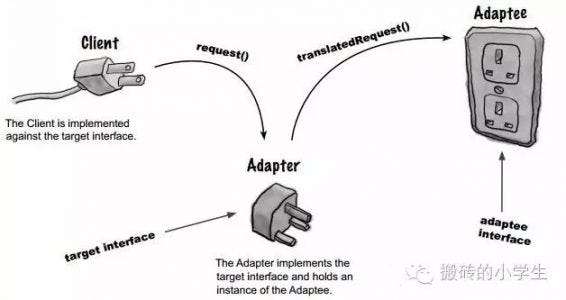

# 🧭 Adapter 🧭

A structural design pattern.

  

### What is Adapter? 🤔

- We have an existing object which provides the functionality that client needs. But client code can't use this object because it expects an object with different interface.

- Using adapter design pattern we make this existing object work with client by adapting the object to client's expected interface.

- This pattern is also called as wrapper as it "wraps" existing object.

### Implement an Adapter 🛠

We start by creating a class for Adapter.

- Adapter must implement the interface expected by client.
- First we are going to try out a class adapter by also extending form our existing class.
- In the class adapter implementation we're simply going to forward the method to another method inherited from adaptee.
- Next for object **adapter**, we are only going to implement target interface and accept adaptee as constructor argument in adapter i.e. make use of composition.

An object adapter should take adaptee as an argument in constructor or as a less preferred solution, you can instantiate it it the constructor thus tightly coupling with a specific adaptee.

### Implementation Considerations 🌟

- How much work the adapter does depends upon the differences between target interface and object being adapted. If method arguments are same or similar adapter has very less work to do.

- Using class adapter "allows" you to override some of the adaptee's behavior. But it's not always a good idea to do so as it can lead to confusion. Fixing defect is not easy anymore!

- Using object adapter allows you to potentially change the adaptee objet to one of its subclasses.

### Design Considerations 🌟

- In java a **"class adapter"** may not be possible if both target and adaptee are concrete classes. In such cases the object adapter is the only solution. Also since there is no private inheritance in java, it's better to stick with object adapter.

- A class adapter is also called as a two way adapter, since it can stand in for both the target interface and for the adaptee. That is we can use object of adapter where either target interface is expected as well as where an adaptee is expected.

## Pitfalls 🚧

- Using target interface and adaptee class to extend our adapter we can create a \*_class adapter_ in java. However, it creates an object which exposes unrelated methods in part of you code, polluting it. Avoid class adapters! it it mentioned here only for sake of completeness.

- It is tempting to do a lot of things in adapter besides simple interface translation. but his can result in an adapter showing different behavior than the adapted object. This can lead to confusion and bugs.

* Not a lot of other pitfalls! As long as we keep them true to their purpose of simple interface translation **they are good**.

## Summary 📚

>[!IMPORTANT]
>We have an existing object with required functionality but the client code is expecting a different interface than our object.

- A class adapter is one where adapter inheris from adaptee and implements target interface.

- An object adapter uses composition. It'll implement the target interface and use an adaptee object composition t o perfom translation. This allows us to use subclasses of adapteea in adapter.
