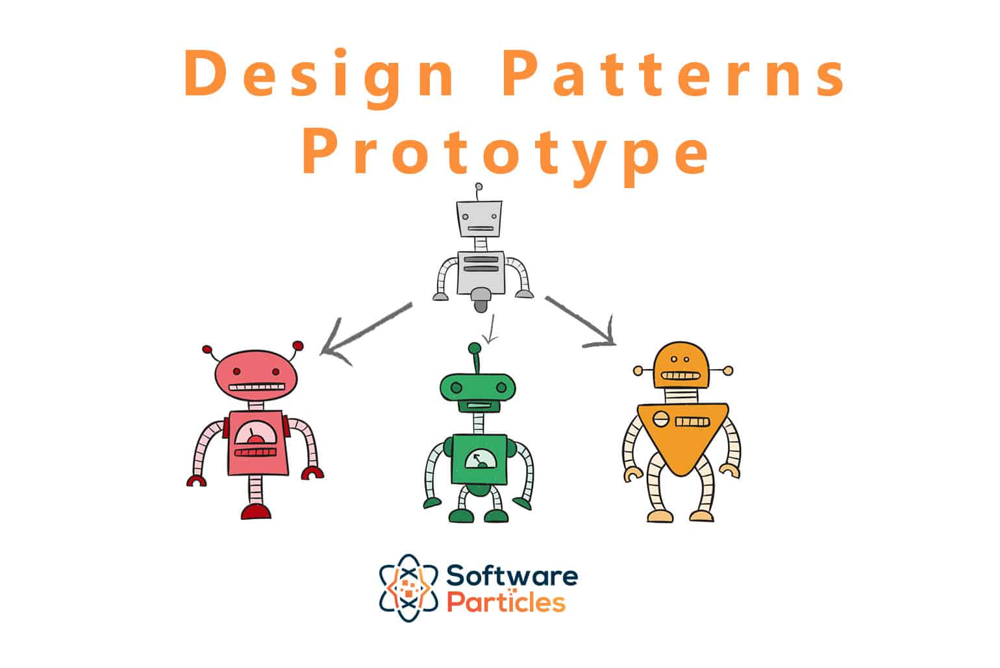
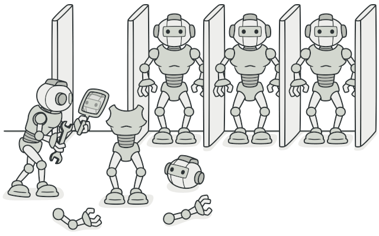

# Prototype Pattern 🧬

The Prototype design pattern is a creational pattern that enables the creation of copies of objects without coupling your code to their specific classes. It involves creating a prototype object and then creating new objects by copying this prototype. This pattern is particularly useful when object creation is expensive or when you want to isolate the process of object creation from the client code.

### Implementing a Prototype 🛠️

To implement a prototype:

- Create a class that implements the *Cloneable* interface.
- Override the `clone` method to return a copy of itself.
- Declare `CloneNotSupportedException` in the `throws` clause to allow subclasses to decide whether to support cloning.

>[!NOTE]
> The implementation of the `clone` method should consider whether to perform a deep or shallow copy, depending on the requirements.

### Example of a Prototype

The `Object.clone()` method in Java serves as an example of a prototype. This method can clone an existing object, enabling any object to act as a prototype. While classes still need to implement `Cloneable`, the `clone` method handles the cloning process.

>[!IMPORTANT]
> Use the prototype pattern when dealing with classes whose states are mostly immutable.

### Prototype vs Singleton

| Aspect | Prototype | Singleton |
|--------|-----------|-----------|
| Purpose | Creates objects by duplicating an existing prototype. | Ensures that only one instance of a class exists throughout the system. |
| Use | Useful when the creation of an object is costly and we want to avoid it by duplicating an existing object. | Useful when strict control over global instances is needed because it only allows one instance of a class. |
| Flexibility | More flexible as it allows cloning existing objects at runtime. | Less flexible as it restricts the instantiation of a class to a single object. |

### Pitfalls to Avoid 🚧

- Usability depends on the immutability or ease of shallow copying of object properties. Objects with complex, mutable states may be difficult to clone.
- In Java, the default clone operation performs a shallow copy, so if a deep copy is required, you must implement it.
- Subclasses may not support cloning, leading to complexity in the code as you need to handle situations where an implementation may not support cloning.

### Summary 📚

- Consider the prototype pattern when object construction is costly or not feasible.
- In Java, the pattern is typically implemented using the `clone` method.
- Objects with mostly immutable states are well-suited for the prototype pattern.
- When implementing the `clone` method, consider whether a deep or shallow copy of the object state is required.
- Ensure that cloned objects are properly initialized before returning them to the outside world.

